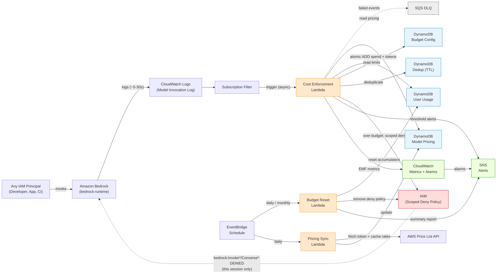

# Bedrock Cost Controls — Near Real-Time Per-User Enforcement

Enforce per-person spending limits on Amazon Bedrock within roughly a minute, for any IAM principal, without
putting a proxy in front of your model calls.

## The Challenge

Amazon Bedrock bills at the account level. It can tell you what you spent, but not *who* spent it, and it
offers no native way to cap an individual person or workload. That gap gets expensive quickly once AI coding
assistants and agentic tools are in use:

- **No per-person attribution.** Bedrock usage arrives as an account-level total. Nothing in the service maps
  spend back to the developer, application, or pipeline that caused it.
- **Cost Explorer is too slow to act on.** Costs surface hours later, aggregated by account and service. By
  the time a runaway workload is visible, the money is already spent.
- **Most of the spend is invisible in the obvious place.** The token count in the invocation log excludes
  prompt cache reads and writes. On a cached agentic workload, metering that field alone can undercount the
  real bill by more than 30x.
- **Shared roles defeat the naive fix.** Under IAM Identity Center many people assume a single role, so
  revoking Bedrock access to stop one person cuts off the entire team.

The conventional answer is a gateway or proxy that every call must route through. That works, but it is
infrastructure to build, scale, secure and operate, and it only governs traffic you can force through it.

## What This Solution Does

It reads Bedrock's own model invocation logs as they arrive, attributes each invocation to the IAM principal
that made it, prices it, and blocks that principal alone when they exceed their budget. Nothing sits in the
request path, so there is no latency added and nothing new to keep highly available.

- Works for **any IAM principal** — developers using coding assistants, applications calling the API directly, notebooks, CI pipelines
- Tracks usage across the four logged Bedrock invocation APIs (`InvokeModel`, `InvokeModelWithResponseStream`, `Converse`, `ConverseStream`)
- Meters **prompt cache reads and writes**, which dominate cost for agentic coding assistants and are excluded from the log's headline token counts
- Attributes cost per IAM principal and enforces via a **session-scoped** IAM deny policy, so one user hitting their limit does not affect others sharing a role
- Sends threshold warnings (default 50% and 80%) before anyone is blocked, and clears budgets automatically on a daily and monthly schedule
- Pricing stays current automatically via the AWS Price List API

> **Read [Scope and Limitations](#scope-and-limitations) before deploying.** This is a *detective control with automated response*, not a preventive one, and it has a hard dependency on Bedrock model invocation logging. Both facts materially affect what it can and cannot enforce.

## What It Costs to Run

This is the cost of the control itself, separate from the Bedrock spend it governs. For 100 users generating
roughly 50,000 invocations per day:

| Resource | Estimated monthly cost |
|---|---|
| Lambda (Cost Enforcement) | ~$2.00 |
| Lambda (Budget Reset + Pricing Sync) | ~$0.10 |
| DynamoDB (4 tables, on-demand) | ~$5.00 |
| CloudWatch alarms (6) | ~$0.60 |
| SNS + SQS | ~$0.50 |
| CloudWatch Logs subscription filter | included |
| **Total** | **under $10 / month** |

Cost scales roughly linearly with invocation volume rather than with user count. The deduplication table is
the highest-write component, at one write per invocation.

Two costs sit outside this table and are worth planning for: Bedrock model invocation logging bills normal
CloudWatch Logs ingestion and storage on your log volume, and point-in-time recovery on the three durable
DynamoDB tables bills on stored data.

## Architecture



### How It Works

1. Any IAM principal invokes a Bedrock model on the `bedrock-runtime` endpoint
2. Bedrock delivers the invocation log to CloudWatch Logs (~5–30s latency)
3. A subscription filter asynchronously triggers the **Cost Enforcement Lambda**
4. The Lambda identifies the caller from `identity.arn`, extracts token usage **including prompt cache reads and writes**, calculates cost across five price components, and atomically increments the user's running spend
5. If spend exceeds the budget, an IAM inline deny policy scoped to that user's role session is attached, blocking further Bedrock invocations for that user only
6. Configurable thresholds (default 50% and 80%) send SNS alerts before enforcement
7. The **Budget Reset Lambda** clears accumulators and removes deny policies on schedule
8. The **Pricing Sync Lambda** refreshes token and cache pricing daily from the AWS Price List API

---

## Scope and Limitations

### This is a detective control, not a preventive one

Spend is measured *after* each invocation completes, from the invocation log. End-to-end reaction time is roughly **30–60 seconds**: 5–30s for Bedrock to deliver the log, plus subscription filter and Lambda processing.

A user can exceed their limit within that window, and a single large-context streaming request can overshoot substantially before the deny lands. If you need a hard preventive cap, that requires an inline proxy or gateway in the request path — this solution cannot provide it.

### Hard dependency: model invocation logging

Nothing works without it. Per AWS documentation, model invocation logging covers the **`bedrock-runtime` endpoint only**, for four operations: `Converse`, `ConverseStream`, `InvokeModel`, `InvokeModelWithResponseStream`.

**The `bedrock-mantle` endpoint is not captured by invocation logging.** That endpoint serves the OpenAI Chat Completions API, the OpenAI Responses API, and the Anthropic Messages API — the compatibility surfaces teams reach for when porting existing OpenAI or Anthropic SDK code with minimal changes. Traffic there is invisible to this solution and effectively has an unlimited budget.

Mantle publishes CloudWatch metrics, but they are aggregates without per-request identity, so they cannot be used to meter a user. Mantle CloudTrail logs inference as a paid **data event** and uses `eventSource: bedrock-mantle.amazonaws.com`, so filters written for `bedrock-runtime.amazonaws.com` will not see it.

**Recommendation:** if you rely on this control, restrict the Mantle endpoint with an SCP or IAM policy so teams cannot route around it.

### Coverage gaps

| Gap | Effect |
|---|---|
| `bedrock-mantle` traffic | Not logged, not metered, not enforced |
| Image / video models (Nova Canvas, Nova Reel, Titan Image) | No token counts in the log, so these price at **$0.00** |
| Imported models (Custom Model Import) | Billed per model-copy-minute, not per token |
| Provisioned Throughput | Billed per model-unit-hour, not per token |
| Batch inference | Discounted ~50%; pricing sync deliberately skips batch usage types |
| Guardrails, Knowledge Bases, Agents | Separately billed, not captured |
| Records without a `usage` object | Cache tokens invisible — alarmed via `EnvelopeOnlyMetering` |

### Accuracy caveats

- **Cache write TTL is handled**, but only where the log carries the breakdown. Writes are priced separately for the 5-minute and 1-hour tiers using `cacheDetails` (Converse) or `cache_creation` (Anthropic native). When neither is present the documented default applies and all writes are treated as 5-minute, which is correct unless a caller set `"ttl": "1h"` on a model whose response omits the breakdown.
- **Streaming.** For `ConverseStream` and `InvokeModelWithResponseStream`, usage arrives in a final metadata chunk. Verify in your account that the logged response body carries the assembled `usage` object; if it does not, those records fall back to envelope-only metering and are alarmed.
- **Large bodies.** Response bodies over 100 KB are offloaded to S3 and replaced with a reference. Output bodies are normally small, but any that are offloaded lose their `usage` object.
- **Unmatched model IDs.** New model IDs can still outpace the matching logic. Unmatched models fall back
  to `FALLBACK_PRICING` (Sonnet-tier), which over-prices cheap models substantially. The fallback errs
  toward over-charging, so enforcement stays conservative rather than permissive, but per-model attribution
  will be wrong. Monitor the `FallbackPricingUsed` metric and the sync response's `unmatched` count. Recent
  unmatched examples were image, video, embedding and speech models plus very new text releases.
- **Application inference profile ARNs** used as `modelId` will not match pricing keys and fall back to `FALLBACK_PRICING` (Sonnet-tier) for the same reason.
- **Rate scope.** `rate_scope` defaults to `global`, which assumes callers use cross-region inference
  profiles. Global rates run roughly 10% below Regional. If your traffic uses bare model IDs pinned to one
  Region, set `rate_scope=regional` or spend will be understated by about 10%. Rows record which scope was
  applied in `rate_scope`.
- **Fallback cache rates.** Until the first Pricing Sync run, cache rates are derived from documented per-family multipliers rather than the Price List API. Rows carry `cache_pricing_source` (`price_list_api` or `derived_multiplier`) so you can tell which is in effect, and the `EstimatedCachePricing` metric fires whenever a multiplier is actually applied to real traffic.

---

## How Cost Is Calculated

Cost is calculated from the `usage` object inside the logged **response body** rather than the log envelope's
headline token count, and it prices five components separately: input, output, cache read, 5-minute cache
write, and 1-hour cache write.

That is the central design decision in this solution, and it exists because the obvious approach is wrong by
a wide margin. The invocation log's `input.inputTokenCount` **excludes** tokens read from or written to the
prompt cache. Per AWS documentation:

```
total input tokens = inputTokens + cacheReadInputTokens + cacheWriteInputTokens
```

Metering the envelope field alone therefore measures only the *residual* — for a coding assistant, roughly just the new user message, while the large cached prefix that drives the bill goes uncounted.

Measured impact for Claude Sonnet 4 with a 120K-token cached prefix and 900 output tokens:

| Scenario | Envelope-only | Correct | Undercount |
|---|---|---|---|
| Conventional call, no caching | $0.019500 | $0.019500 | none |
| Warm cache (120K read) | $0.014550 | $0.050550 | 3.5x |
| Cold cache (120K write) | $0.014550 | $0.464550 | **32x** |

Cache writes bill at a premium, and coding assistants rewrite cache frequently as context grows and on TTL expiry. This solution recovers the counts from `output.outputBodyJson.usage` and prices each component separately.

**Provider conventions differ, and the difference is inverted:**

| API shape | Cache fields | `inputTokens` semantics |
|---|---|---|
| Converse / ConverseStream | `cacheReadInputTokens`, `cacheWriteInputTokens`, `cacheDetails` | **Excludes** cache |
| Anthropic native (`InvokeModel`) | `cache_read_input_tokens`, `cache_creation_input_tokens`, `cache_creation` | **Excludes** cache |
| OpenAI-compatible | `input_tokens_details.cached_tokens`, `.cache_write_tokens` | **Includes** cache |

Applying one formula across all three would double-count the cached prefix on OpenAI models. `_extract_token_usage` keys on the response shape; see `tests/test_cost_logic.py` for the cases.

### Cache writes are billed by TTL

Anthropic offers a 5-minute and a 1-hour cache tier at different rates, so pricing every write at the
5-minute rate understates a 1-hour write by 37.5%. The two are separated using `cacheDetails`
(`{"inputTokens": N, "ttl": "5m"|"1h"}`) or `cache_creation`, which is why the model prices five components
rather than four. Only Claude Opus 4.5, Sonnet 4.5 and Haiku 4.5 support the 1-hour tier; everything else
defaults to 5-minute, which is also the documented default when no `ttl` is supplied.

### Where the rates come from

Rates are pulled daily from the AWS Price List API. Bedrock pricing is split across two service codes and
querying only the legacy one misses every current-generation Anthropic model, so the Pricing Sync Lambda
queries both `AmazonBedrock` and `AmazonBedrockFoundationModels`, normalizes their differing units to a
common per-1K basis, and prefers the foundation-models source. Every pricing row records which source and
rate scope produced it.

Where the API publishes no cache rate, rates fall back to per-family multipliers of the uncached input rate,
keyed by model family because the ratios are not universal — Anthropic cache writes cost more than uncached
input, while Amazon Nova cache writes are genuinely free. Published rates always take precedence, and the
`EstimatedCachePricing` metric fires whenever a fallback multiplier is actually applied to live traffic.

---

## Enforcement and Shared Roles

`user_id` is derived from the **session name** in `identity.arn`, but IAM inline policies attach to the **role**. On a shared role — the normal IAM Identity Center pattern, where many people assume one role — an unscoped deny would block Bedrock for *every* user of that role.

The deny policy is therefore scoped with a condition on `aws:userid`, whose value for a role session is `<role-unique-id>:<session-name>`:

```json
{
  "Sid": "BudgetExceededDenyBedrock",
  "Effect": "Deny",
  "Action": [
    "bedrock:InvokeModel",
    "bedrock:InvokeModelWithResponseStream",
    "bedrock:Converse",
    "bedrock:ConverseStream"
  ],
  "Resource": "*",
  "Condition": {
    "StringLike": { "aws:userid": "AROAEXAMPLEROLEID:alice" }
  }
}
```

Building this requires `iam:GetRole` to read the role's unique ID. If that call fails and `REQUIRE_SCOPED_DENY` is `true` (the default), the Lambda **declines to enforce** and raises an alert instead of attaching an unscoped deny. Failing to block one user is far less damaging than blocking an entire team.

Set `require_scoped_deny=false` only if every role in the account belongs to a single principal.

**Inline policy size limits.** IAM caps aggregate inline policy size at 10,240 characters per role and 2,048 per user, excluding whitespace. Each deny policy is roughly 300 characters, so a shared role accommodates on the order of 30 concurrently denied users. Beyond that, consolidate into a single policy listing multiple session names in one condition.

---

## Prerequisites

- AWS CDK v2 CLI (`npm install -g aws-cdk`)
- Python 3.12+
- AWS credentials able to deploy CloudFormation, Lambda, DynamoDB, SNS, SQS, CloudWatch, IAM, and EventBridge
- **Bedrock model invocation logging enabled**, writing to a CloudWatch Logs group, with **text** data delivery on
- A free subscription filter slot on that log group (CloudWatch Logs allows 2 per log group; if you already stream these logs to a SIEM, confirm capacity)

## Project Structure

```
bedrock-cost-controls/
├── app.py                              # CDK app entry point
├── cdk.json                            # CDK configuration
├── requirements.txt                    # CDK build dependencies
├── requirements-dev.txt                # Test + review tooling (not needed to deploy)
├── LICENSE                             # MIT No Attribution (MIT-0)
├── CONTRIBUTING.md                     # How to report issues and submit changes
├── CODE_OF_CONDUCT.md                  # Amazon Open Source Code of Conduct
├── infra/
│   └── cost_controls_stack.py          # CDK stack — all AWS resources
├── lambdas/
│   ├── cost_enforcement/handler.py     # Cost tracking + scoped deny enforcement
│   ├── budget_reset/handler.py         # Scheduled reset + unlock
│   └── pricing_sync/handler.py         # Daily pricing sync (tokens + cache rates)
├── scripts/
│   └── seed_pricing.py                 # Bootstrap pricing + default budget
├── tests/
│   └── test_cost_logic.py              # Unit tests, no AWS required
└── notebooks/
    ├── demo_cost_controls.ipynb        # End-to-end walkthrough against a live stack
    └── requirements-demo.txt           # Pinned notebook dependencies
```

## Deployment

Deploying to an account that already has this stack? Read
[Updating an existing deployment](#updating-an-existing-deployment) first — the context values must
match the current deployment or you will silently break metering.

### 1. Install dependencies

```bash
python -m venv .venv

# macOS / Linux
source .venv/bin/activate

# Windows PowerShell
.venv\Scripts\Activate.ps1

pip install -r requirements.txt

# To also run the unit tests:
pip install -r requirements-dev.txt
```

> **The virtual environment must be active when you run `cdk`.** `cdk.json` sets
> `"app": "python app.py"`, so the CDK CLI shells out to whatever `python` resolves to on `PATH`. If the
> venv is not active it will use the system interpreter, which does not have `aws-cdk-lib` installed, and
> synthesis fails with an import error.
>
> If activation is blocked by PowerShell execution policy, prepend the venv to `PATH` for the session
> instead:
>
> ```powershell
> $env:PATH = "$PWD\.venv\Scripts;$env:PATH"
> python -c "import sys; print(sys.executable)"   # should point into .venv
> ```

### 2. Bootstrap CDK (first time per account and Region)

```bash
cdk bootstrap aws://ACCOUNT_ID/REGION
```

Already bootstrapped if a `CDKToolkit` CloudFormation stack exists:

```bash
aws cloudformation describe-stacks --stack-name CDKToolkit \
  --query 'Stacks[0].StackStatus' --output text --region us-east-1
```

### 3. Enable Bedrock model invocation logging

Do this **before** deploying, so the log group exists. Follow the AWS documentation for the setup itself:
[Monitor model invocation using CloudWatch Logs and Amazon S3](https://docs.aws.amazon.com/bedrock/latest/userguide/model-invocation-logging.html).

Two choices in that setup are load-bearing for this solution:

- Logs must go to **CloudWatch Logs** (either the CloudWatch-only or the CloudWatch and S3 destination). An
  S3-only configuration cannot drive the subscription filter this stack depends on.
- At least the **Text** data type must be enabled. The `usage` object that carries prompt cache tokens lives
  in the logged response body, and without it every record falls back to envelope-only metering.

Confirm the log group exists and note its exact name — the stack references it rather than creating it, so
a wrong name fails the deploy:

```bash
aws bedrock get-model-invocation-logging-configuration --region us-east-1
aws logs describe-log-groups --log-group-name-prefix /aws/bedrock \
  --query 'logGroups[].logGroupName' --output table --region us-east-1
```

Also check there is a free subscription filter slot. CloudWatch Logs permits **two per log group**, and
this stack needs one:

```bash
aws logs describe-subscription-filters \
  --log-group-name "<your-log-group>" \
  --query 'subscriptionFilters[].{name:filterName,dest:destinationArn}' \
  --output table --region us-east-1
```

If two filters already exist and neither belongs to this stack, remove one or the deploy will fail.

### 4. Review the change set, then deploy

Always diff first. It shows the IAM changes and, on an update, whether anything will be replaced:

```bash
cdk diff \
  -c bedrock_log_group_name="/aws/bedrock/InvocationLogs" \
  -c alert_email="team@example.com" \
  -c default_daily_limit="50" \
  -c default_monthly_limit="500"
```

Confirm that `AWS::Logs::SubscriptionFilter` shows no change or an in-place update. A *replacement* would
briefly free and re-take the filter slot, which can fail if the log group is already at its limit of two.

```bash
cdk deploy \
  -c bedrock_log_group_name="/aws/bedrock/InvocationLogs" \
  -c alert_email="team@example.com" \
  -c default_daily_limit="50" \
  -c default_monthly_limit="500"
```

CDK prompts for confirmation because the stack modifies IAM policies. Add `--require-approval never` for
non-interactive or pipeline use, but only after reviewing the diff.

Deployment takes roughly two minutes.

#### Context Parameters

| Parameter | Default | Description |
|---|---|---|
| `bedrock_log_group_name` | `/aws/bedrock/model-invocations` | CloudWatch Logs group Bedrock writes invocation logs to |
| `alert_email` | *(none)* | Email subscribed to the SNS alert topic |
| `default_daily_limit` | `50` | Default daily budget per user (USD) |
| `default_monthly_limit` | `500` | Default monthly budget per user (USD) |
| `reset_timezone` | `America/Chicago` | Timezone reference for reset schedule naming |
| `require_scoped_deny` | `true` | Refuse to attach a deny that cannot be scoped to one session |
| `rate_scope` | `global` | Which Price List rate scope to store. `global` matches cross-region inference profiles; `regional` matches bare model IDs pinned to one Region |
| `cache_read_multiplier` | `0.10` | Fallback cache-read rate, for families without a built-in ratio |
| `cache_write_multiplier` | `1.25` | Fallback 5-minute cache-write rate, same scope |
| `cache_write_1h_multiplier` | `2.00` | Fallback 1-hour cache-write rate, same scope |

The three multiplier parameters apply **only** to model families with no built-in ratio. Anthropic and
Amazon Nova ratios are hardcoded from verified published rates and are not affected. All of them are
superseded by real rates once the Pricing Sync Lambda runs.

### 5. Seed pricing, then sync — in that order

**Order matters.** Both write with `PutItem`, which replaces the whole row. Seeding populates *derived*
cache rates as a floor; the sync then overwrites with *authoritative* rates wherever the Price List API
publishes them. Running them in the other order discards the real rates.

```bash
# 5a. Seed: bootstrap pricing with derived cache rates, plus the DEFAULT budget row
python scripts/seed_pricing.py --region us-east-1

# 5b. Sync: replace derived rates with real Price List API rates where available
aws lambda invoke --function-name BedrockPricingSync --payload '{}' \
  --cli-binary-format raw-in-base64-out /dev/stdout
```

The sync response looks like this:

```json
{
  "updated": 62,
  "rate_scope": "global",
  "by_source": {"foundation_models": 14, "legacy": 48},
  "with_cache_pricing": 21,
  "with_1h_cache_pricing": 5,
  "without_cache_pricing": 41,
  "cross_region_variants": 39,
  "unmatched": 57
}
```

Interpretation:

- **`by_source`** — how many models resolved from each Price List service code. A `foundation_models` count
  of zero means current-generation Claude is not being priced; check that the Lambda can reach the
  `AmazonBedrockFoundationModels` service code.
- **`with_cache_pricing`** — authoritative cache rates applied. Rows carry
  `cache_pricing_source: price_list_api`.
- **`with_1h_cache_pricing`** — models that also published a 1-hour TTL cache-write rate. Expect a small
  number; only Claude Opus 4.5, Sonnet 4.5 and Haiku 4.5 support that tier.
- **`without_cache_pricing`** — matched for input/output but no cache rates published. These use the
  per-family multiplier fallback, or the derived seed values.
- **`unmatched`** — no pricing match at all. **These fall back to `FALLBACK_PRICING` (Sonnet-tier), which
  significantly over-prices cheap models.** Expect a nontrivial count, mostly image, video, embedding and
  speech models plus very recent text releases.

Check which models are unpriced or unmatched before trusting the numbers:

```bash
# models with no cache rates
aws dynamodb scan --table-name BedrockModelPricing --region us-east-1 \
  --filter-expression "attribute_not_exists(cache_read_price_per_1k_tokens)" \
  --projection-expression "model_id" --output text

# fallback pricing actually being hit at runtime
aws cloudwatch get-metric-statistics --namespace BedrockCostControls \
  --metric-name FallbackPricingUsed --statistics Sum --period 86400 \
  --start-time "$(date -u -d '7 days ago' +%Y-%m-%dT%H:%M:%SZ)" \
  --end-time "$(date -u +%Y-%m-%dT%H:%M:%SZ)" --region us-east-1
```

To price an unmatched model correctly, add a pattern to `MODEL_ID_TO_PRICE_KEY_PATTERNS` in
`lambdas/pricing_sync/handler.py` or add an explicit row to the pricing table.

The sync also runs on its own daily at 02:00 UTC.

### 6. Confirm the SNS subscription

Check the alert inbox and confirm. Until confirmed, neither budget alerts nor CloudWatch alarms are
delivered.

```bash
aws sns list-subscriptions-by-topic --region us-east-1 \
  --topic-arn "$(aws cloudformation describe-stack-resources \
    --stack-name BedrockCostControlsStack --region us-east-1 \
    --query "StackResources[?ResourceType=='AWS::SNS::Topic'].PhysicalResourceId" --output text)" \
  --query 'Subscriptions[].{protocol:Protocol,endpoint:Endpoint,arn:SubscriptionArn}' --output table
```

A `SubscriptionArn` of `PendingConfirmation` means the email link has not been clicked yet.

### 7. Verify the deployment

Unit tests first — these need no AWS access:

```bash
python -m pytest tests/ -v          # or: python tests/test_cost_logic.py
```

Then confirm the deployed resources match expectations:

```bash
# new env vars, DLQ wiring
aws lambda get-function-configuration --function-name BedrockCostEnforcement \
  --region us-east-1 \
  --query '{dlq:DeadLetterConfig.TargetArn,env:Environment.Variables}'

# all six alarms present
aws cloudwatch describe-alarms --alarm-name-prefix BedrockCostControls- \
  --region us-east-1 \
  --query 'MetricAlarms[].{name:AlarmName,state:StateValue}' --output table

# DLQ should be empty
aws sqs get-queue-attributes --region us-east-1 \
  --queue-url "$(aws sqs get-queue-url --queue-name BedrockCostEnforcementDLQ \
    --region us-east-1 --query QueueUrl --output text)" \
  --attribute-names ApproximateNumberOfMessages
```

Expected: `REQUIRE_SCOPED_DENY=true`, `CACHE_READ_MULTIPLIER`, `CACHE_WRITE_MULTIPLIER` and
`METRIC_NAMESPACE` all set; `dlq` pointing at `BedrockCostEnforcementDLQ`; six alarms in `OK` or
`INSUFFICIENT_DATA`; zero DLQ messages.

### 8. Run the end-to-end walkthrough

`notebooks/demo_cost_controls.ipynb` exercises the full loop against the deployed stack. It creates a
throwaway IAM role so no real principal is touched, drives spend through both alert thresholds, triggers
enforcement, proves the deny with the IAM policy simulator, verifies that prompt cache tokens are metered
and that cache spend alone can breach a budget, and checks all four response shapes are classified
correctly. No real Bedrock spend is incurred.

```bash
pip install -r notebooks/requirements-demo.txt
python -m ipykernel install --user --name bedrock-cost-controls \
  --display-name "Python (bedrock-cost-controls)"
```

Open the notebook, select the **Python (bedrock-cost-controls)** kernel, set `REGION` in cell 0, and run
top to bottom. Section 11 asserts PASS/FAIL, so it doubles as a deployment check: if it reports the older
two-term cost model, the deployed Lambda is stale.

---

## Updating an existing deployment

Context values are **not** persisted in the stack. Any value you omit reverts to the default in
`cost_controls_stack.py`, which on an update means:

- Omitting `bedrock_log_group_name` repoints the subscription filter at
  `/aws/bedrock/model-invocations`. If that log group does not exist the deploy fails; if it does exist but
  is not where Bedrock writes, metering silently stops.
- Omitting `alert_email` deletes the SNS email subscription, so alerts and alarms stop being delivered.

Recover the current values before updating:

```bash
# log group currently wired to the enforcement Lambda
aws logs describe-subscription-filters --region us-east-1 \
  --log-group-name "$(aws bedrock get-model-invocation-logging-configuration \
    --region us-east-1 --query 'loggingConfig.cloudWatchConfig.logGroupName' --output text)" \
  --query "subscriptionFilters[?contains(destinationArn,'BedrockCostEnforcement')].logGroupName" \
  --output text

# current default limits
aws lambda get-function-configuration --function-name BedrockCostEnforcement \
  --region us-east-1 \
  --query 'Environment.Variables.{daily:DEFAULT_DAILY_LIMIT,monthly:DEFAULT_MONTHLY_LIMIT}'

# current alert email
aws sns list-subscriptions --region us-east-1 \
  --query "Subscriptions[?contains(TopicArn,'BudgetAlertTopic')].Endpoint" --output text
```

Before updating, check whether anyone is currently denied. An update does not remove deny policies, but
you want to know the blast radius if something goes wrong:

```bash
aws dynamodb scan --table-name BedrockUserUsage --region us-east-1 \
  --filter-expression "is_denied = :t" \
  --expression-attribute-values '{":t":{"BOOL":true}}' \
  --projection-expression "user_id, iam_role_name" --output table
```

Then `cdk diff` with the recovered values, confirm no replacements, and deploy. After updating from a
version predating cache metering, re-run step 5 so the pricing table gains its cache columns.

---

## Monitoring

Six alarms publish to the SNS topic. The first three catch conditions where **spend goes unmetered**, which is this solution's worst failure mode because it fails silently.

| Alarm | Meaning | Action |
|---|---|---|
| `EnforcementThrottled` | Reserved concurrency (50) exceeded. Async invocations are retried then discarded, so spend goes unmetered. | Raise `reserved_concurrent_executions` |
| `EnforcementErrors` | Lambda is erroring; spend may not be tracked | Check logs |
| `EnforcementDLQNotEmpty` | Events failed processing entirely — spend never attributed | Inspect `BedrockCostEnforcementDLQ` |
| `EnvelopeOnlyMetering` | Records metered without a `usage` object, so cache tokens are invisible and cached workloads undercounted | Verify text data delivery is enabled |
| `UnscopableDenySkipped` | A user exceeded budget but no deny was attached because it could not be scoped | Verify `iam:GetRole`; enforce manually if needed |
| `DenyAttachFailures` | IAM rejected the deny (throttling or permissions). User can still invoke Bedrock. | Check logs |

### Custom metrics

Emitted via CloudWatch Embedded Metric Format under namespace `BedrockCostControls` (no `PutMetricData` permission needed): `AttributedCostUsd` (dimensioned by `usage_source`), `CacheReadTokens`, `CacheWriteTokens`, `BudgetEnforced`, `FallbackPricingUsed`, `EnvelopeOnlyMetering`, `EstimatedCachePricing` (dimensioned by `model_id` and `component`), `UnscopableDenySkipped`, `DenyAttachFailures`, `RecordProcessingFailures`.

`EstimatedCachePricing` is the one to watch for accuracy: it fires when cache tokens were priced from a
family multiplier rather than a published rate. A sustained non-zero value on a model you care about means
the Pricing Sync is not resolving that model — check the sync response's `unmatched` list.

### Reconciling accuracy

Bedrock publishes `CacheReadInputTokens` and `CacheWriteInputTokens` runtime metrics. Compare those against the `daily_cache_read_tokens` and `daily_cache_write_tokens` totals in `BedrockUserUsage` for the same period. Divergence means records are being dropped — an accuracy check independent of this solution's own code.

---

## Operations

### Set a per-user budget

```bash
aws dynamodb put-item --table-name BedrockBudgetConfig --item '{
  "user_id": {"S": "jdoe"},
  "daily_limit_usd": {"N": "100"},
  "monthly_limit_usd": {"N": "1000"},
  "alert_thresholds": {"L": [{"N": "0.5"}, {"N": "0.8"}]},
  "team": {"S": "platform"}
}'
```

Users without a row fall back to `DEFAULT`. Budget config is cached in-process for 60 seconds, so changes take effect within a minute.

### Check a user's spend and token breakdown

```bash
aws dynamodb get-item --table-name BedrockUserUsage \
  --key '{"user_id": {"S": "jdoe"}}'
```

`daily_cache_read_tokens` and `daily_cache_write_tokens` show how much of the spend is cache-driven. `last_usage_source` shows which response shape was parsed — `envelope_only` means cache activity was not visible for that record.

### Manually unlock a user

```bash
# assumed-role principals
aws iam delete-role-policy --role-name MyRole --policy-name BudgetExceeded-jdoe

# IAM users
aws iam delete-user-policy --user-name jdoe --policy-name BudgetExceeded-jdoe
```

Then clear the tracking flags:

```bash
aws dynamodb update-item --table-name BedrockUserUsage \
  --key '{"user_id": {"S": "jdoe"}}' \
  --update-expression "SET is_denied = :f REMOVE alerts_sent" \
  --expression-attribute-values '{":f": {"BOOL": false}}'
```

Removing `alerts_sent` re-arms threshold alerts. Leaving it set suppresses further alerts until the next scheduled reset.

### Trigger a manual reset

```bash
aws lambda invoke --function-name BedrockBudgetReset \
  --payload '{"reset_type": "daily"}' \
  --cli-binary-format raw-in-base64-out /dev/stdout
```

---

## DynamoDB Data Model

### BedrockModelPricing

| Attribute | Type | Description |
|---|---|---|
| `model_id` (PK) | String | Bedrock model ID, e.g. `anthropic.claude-sonnet-4-v1:0` |
| `input_price_per_1k_tokens` | Number | Cost per 1,000 non-cached input tokens |
| `output_price_per_1k_tokens` | Number | Cost per 1,000 output tokens |
| `cache_read_price_per_1k_tokens` | Number | Cost per 1,000 tokens read from prompt cache |
| `cache_write_price_per_1k_tokens` | Number | Cost per 1,000 tokens written to cache, 5-minute TTL |
| `cache_write_1h_price_per_1k_tokens` | Number | Cost per 1,000 tokens written to cache, 1-hour TTL |
| `cache_pricing_source` | String | `price_list_api` or `derived_multiplier` |
| `pricing_service_code` | String | `AmazonBedrock` or `AmazonBedrockFoundationModels` |
| `rate_scope` | String | `global` (cross-region inference) or `regional` |
| `effective_date` | String | Date pricing became effective |
| `last_synced` | String | ISO timestamp of last sync |
| `source` | String | `price_list_api` or `manual_seed` |

Cache columns are optional. When absent, the enforcement Lambda derives rates from the per-family
multipliers rather than pricing cache tokens at zero, and emits `EstimatedCachePricing`. Only models
supporting the 1-hour tier carry `cache_write_1h_price_per_1k_tokens`.

### BedrockUserUsage

| Attribute | Type | Description |
|---|---|---|
| `user_id` (PK) | String | Derived from the caller's IAM ARN (session name for roles) |
| `daily_spend_usd` | Number | Running total for current day |
| `monthly_spend_usd` | Number | Running total for current month |
| `daily_invocation_count` | Number | Invocations today |
| `daily_input_tokens` | Number | Non-cached input tokens today |
| `daily_output_tokens` | Number | Output tokens today |
| `daily_cache_read_tokens` | Number | Prompt cache reads today |
| `daily_cache_write_tokens` | Number | Prompt cache writes today, all TTL tiers |
| `daily_cache_write_1h_tokens` | Number | Of those writes, the portion on the 1-hour tier |
| `last_usage_source` | String | `converse`, `anthropic_native`, `openai`, `usage_no_cache`, or `envelope_only` |
| `alerts_sent` | String Set | Threshold alerts already fired, e.g. `{"daily:50"}`. Cleared on reset. |
| `last_invocation_ts` | String | Timestamp of last processed invocation |
| `is_denied` | Boolean | Whether a deny policy is currently active |
| `denied_at` | String | Unix timestamp when the deny was applied |
| `iam_role_name` | String | IAM role, for assumed-role principals |
| `iam_user_name` | String | IAM user name, for IAM user principals |
| `principal_type` | String | `role`, `user`, or `unknown` |

### BedrockBudgetConfig

| Attribute | Type | Description |
|---|---|---|
| `user_id` (PK) | String | User ID, or `DEFAULT` for the org-wide default |
| `daily_limit_usd` | Number | Daily budget cap |
| `monthly_limit_usd` | Number | Monthly budget cap |
| `alert_thresholds` | List | e.g. `[0.5, 0.8]` — fractions of the limit that trigger alerts |
| `team` | String | Optional grouping label, available for future routing |

---

## Scale Considerations

| Area | Current behaviour | When to revisit |
|---|---|---|
| Lambda concurrency | 50 reserved; throttling alarmed | Raise before sustained throttling |
| Per-record DynamoDB ops | 1 dedup write, 1 usage update, cached pricing + budget reads | Budget config cached 60s in-process |
| Budget reset | Filtered `Scan` with projection, 5-minute timeout | Sparse GSI or segmented parallel scan beyond tens of thousands of users |
| Hot partition | All of a user's writes target one item (~1,000 WCU/s per key) | Consider sharding for very high-volume agentic workloads |
| IAM API limits | `PutRolePolicy` is rate-limited; failures alarmed | Correlated mass enforcement can throttle |
| Deny policies per role | ~30 concurrent on a shared role (10,240-char cap) | Consolidate into one multi-session condition |

## Tear Down

```bash
cdk destroy
```

Tables with `RemovalPolicy.RETAIN` (Pricing, Usage, BudgetConfig) survive. Remove manually if desired:

```bash
aws dynamodb delete-table --table-name BedrockModelPricing
aws dynamodb delete-table --table-name BedrockUserUsage
aws dynamodb delete-table --table-name BedrockBudgetConfig
```

Deny policies attached at teardown time are **not** removed automatically. Audit before destroying:

```bash
aws iam list-roles --query 'Roles[].RoleName' --output text | tr '\t' '\n' | \
  while read r; do
    aws iam list-role-policies --role-name "$r" \
      --query "PolicyNames[?starts_with(@,'BudgetExceeded-')]" --output text
  done
```

## Security

See [CONTRIBUTING](CONTRIBUTING.md#security-issue-notifications) for more information.

## License

This library is licensed under the MIT-0 License. See the [LICENSE](LICENSE) file.
